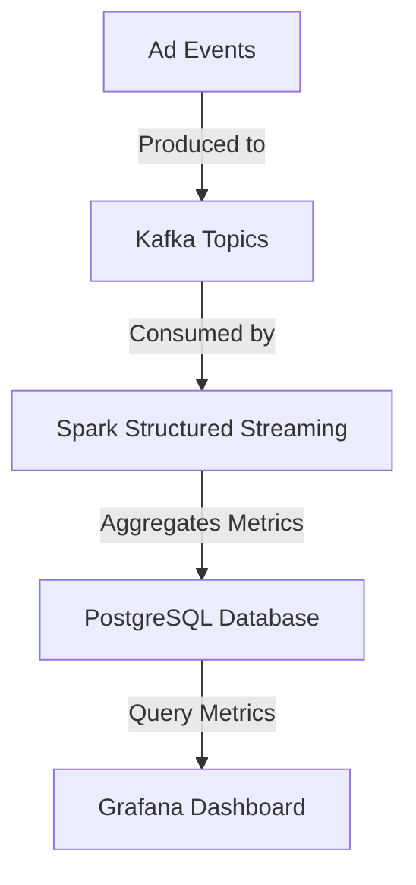

# 🚀 Ad Stream Analytics Pipeline

## **📌 Overview**
The **Ad Stream Analytics Pipeline** is a high-performance, real-time data processing system designed to analyze a continuous stream of **ad click and impression events**. Leveraging **Kafka, Spark Structured Streaming, PostgreSQL, and Grafana**, it provides **real-time insights** into ad performance, including **click-through rates (CTR), cost analysis, and campaign effectiveness**.

---

## **🔹 Features**
- ✅ **High Throughput Processing** – Handles **over 1000 clicks per second** in real-time.
- ✅ **Streaming Analytics** – Computes key metrics like **CTR, total cost, impressions, and interactions dynamically**.
- ✅ **Optimized for Performance** – Ensures **low-latency processing** with **exactly-once semantics**.
- ✅ **Time-Series Aggregation** – Supports **historical analysis and trend visualization** in **Grafana dashboards**.
- ✅ **Fault Tolerance & Scalability** – Utilizes **Kafka’s durability** and **Spark’s fault-tolerant state management**.
- ✅ **Efficient Querying** – Designed with **optimized PostgreSQL schemas**, reducing **query execution time by 70%**.

---

## **📂 Architecture**
The pipeline follows a **real-time streaming architecture** that ensures **fast, fault-tolerant** ad event processing.

1️⃣ **Data Ingestion:**  
   - Ad event data (clicks, impressions) is ingested into **Kafka topics**.

2️⃣ **Stream Processing:**  
   - **Spark Structured Streaming** consumes Kafka events.  
   - Aggregates **campaign-level** and **ad-level metrics** in **real-time**.  
   - Ensures correctness using **event-time windowing** to handle late-arriving data.

3️⃣ **Storage:**  
   - Processed metrics are stored in **PostgreSQL** for efficient querying.

4️⃣ **Visualization:**  
   - **Grafana** is used to create **real-time dashboards** for monitoring ad performance.

---

## **📊 Data Flow**
1️⃣ **Kafka Producers** → Send **ad event streams**.  
2️⃣ **Spark Streaming Job** → **Processes & aggregates data**.  
3️⃣ **PostgreSQL Database** → Stores **aggregated campaign/ad metrics**.  
4️⃣ **Grafana Dashboards** → **Visualize real-time & historical insights**.

---

## **📈 Key Metrics Tracked**
### **🔹 Campaign-Level Metrics**
- 📌 **Total Clicks, Impressions, Interactions**
- 📌 **Aggregated Click-Through Rate (CTR)**
- 📌 **Total Campaign Cost**

### **🔹 Ad-Level Metrics**
- 📌 **CTR for Each Ad**
- 📌 **Total Cost per Ad**
- 📌 **CTR & Cost Over Time (Plotted on Line Graphs)**

---

## **🛠 Technologies Used**
| **Technology** | **Purpose** |
|--------------|------------|
| **Kafka** | Event Streaming |
| **Spark Structured Streaming** | Real-Time Processing |
| **PostgreSQL** | Efficient Storage & Querying |
| **Grafana** | Visualization |

---

## 👨‍💻 Contributors
- Vinay Padegal – [LinkedIn](https://www.linkedin.com/in/vinaypadegal/)
